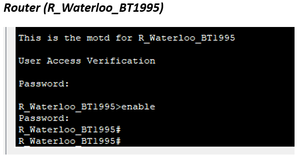

# Networking Lab Portfolio

## Table of Contents

- [Lab 1 – Simple Network Topology](#lab-1--simple-network-topology)  
  - [Part 1: Building the Topology](#part-1-building-the-topology)  
  - [Part 2: Configuring the Topology](#part-2-configuring-the-topology)  
  - [Part 3: Configuring the Privileged Mode Password](#part-3-configuring-the-privileged-mode-password)  
  - [Part 4: Enforcing Login](#part-4-enforcing-login)  
  - [Part 5: Configuring Secure Shell](#part-5-configuring-secure-shell)  
  - [Part 6: Configuring IP Addresses](#part-6-configuring-ip-addresses)  
  - [Part 7: Connecting Using SSH](#part-7-connecting-using-ssh)  
  - [Observations](#observations)  

- [Lab 2 – Static Routing](#lab-2--static-routing)  
  - [Part 1: Building the Topology](#part-1-building-the-topology-1)  
  - [Part 2: Configuring the Topology](#part-2-configuring-the-topology-1)  
  - [Part 3: Configuring the Privileged Mode Password](#part-3-configuring-the-privileged-mode-password-1)  
  - [Part 4: Enforcing Login](#part-4-enforcing-login-1)  
  - [Part 5: Configuring Secure Shell](#part-5-configuring-secure-shell-1)  
  - [Part 6: Configuring IP Addresses](#part-6-configuring-ip-addresses-1)  
  - [Part 7: Configuring Static Routes](#part-7-configuring-static-routes)  
  - [Observations](#observations-1)  

---

## Lab 1 – Simple Network Topology

**Overview:**  
Lab 1 demonstrates building a simple network topology using 2 Layer-2 switches, 1 router, a web server, and workstations.

**Devices Used:**
- Router 2811  
- 2960 Switch × 2  
- PC × 2  
- Web Server  
- Laptop  

### Part 1: Building the Topology

**Device Hostnames:**

| Device | Hostname |
|--------|---------|
| Router | R_Waterloo_BT1995 |
| Switch 1 | CS_SW1_BT1995 |
| Switch 2 | IT_SW2_BT1995 |
| PC 1 | PC1_VM1_BT1995 |
| PC 2 | IT_VM2_BT1995 |
| Laptop | Laptop_BT1995 |
| Server | Waterloo_Web_BT1995 |

**Topology Diagram:**  

  


---

### Part 2: Configuring the Topology

Configured **MOTD banners** on all devices:

```bash
banner motd # Welcome to <Device Name> #
```

**Screenshots:**

- Router MOTD →
  
  

  
- Switch1 MOTD →
  
  

  
- Switch2 MOTD →
  
    


---

### Part 3: Configuring the Privileged Mode Password

```bash
enable password <Password>
```

**Screenshots:**
- Router →
  
  

  
- Switch1 →
  
  

  
- Switch2 →
  
  
  

---

### Part 4: Enforcing Login

Configured **console and VTY passwords** and encrypted them:

```bash
line console 0
password <Password>
login
exit

line vty 0 15
password <Password>
login
exit

service password-encryption
```

**Screenshots:**
- Router →
  
  

    
- Switch1 →
  
  

  
- Switch2 →
  
  
  

---

### Part 5: Configuring Secure Shell (SSH)

Steps performed:  
1. Set hostname and domain name (`itns.local`).  
2. Enabled AAA authentication: `aaa new-model`.  
3. Created a user: `<initials + last 4 digits >`.  
4. Generated RSA keys: `crypto key generate rsa`.  
5. Set SSH version 2: `ip ssh version 2`.  
6. Configured VTY lines for SSH and Telnet.

**Screenshots:**
- Router →
  
  
  
   

 
- Switch1 →
  
  

  


- Switch2 →
  
  
  
     


---

### Part 6: Configuring IP Addresses

**Router Interfaces:**

| Interface | Network | IP Address |
|-----------|--------|------------|
| Eth0/1 | INTERNET | 172.16.1.1/24 |
| Eth0/2 | INSIDE | 172.16.200.1/24 |
| Eth0/3 | DMZ | 172.16.60.1/24 |

**Switch VLAN 1 IPs:**

| Switch | IP Address |
|--------|-----------|
| CS_SW1_BT1995 | 172.16.200.2 |
| IT_SW2_BT1995 | 172.16.60.2 |

**PCs and Server IPs:**

| Device | IP Address |
|--------|-----------|
| PC1_VM1_BT1995 | 172.16.200.3 |
| IT_VM2_BT1995 | 172.16.60.3 |
| Waterloo_Web_BT1995 | 172.16.1.2 |

**Ping Tests:**  
*Add screenshots of successful pings:*  
- PC1 → Router: `screenshots/pc1_router_ping.png`  
- PC1 → Switch1: `screenshots/pc1_switch1_ping.png`  
- PC1 → Switch2: `screenshots/pc1_switch2_ping.png`  
- PC1 → Web Server: `screenshots/pc1_server_ping.png`  

---

### Part 7: Connecting Using SSH

**From PCs to switches and routers:**

```bash
ssh <username>@<device_ip>
```

**Screenshots:**
- PC2 → Switch2 → `screenshots/pc2_switch2_ssh.png`  
- PC2 → Router → `screenshots/pc2_router_ssh.png`  
- PC1 → Switch1 → `screenshots/pc1_switch1_ssh.png`  
- PC1 → Router → `screenshots/pc1_router_ssh.png`  

**Switch-to-Switch SSH connections:**
- IT_SW2 → CS_SW1 → `screenshots/switch2_switch1_ssh.png`  
- CS_SW1 → IT_SW2 → `screenshots/switch1_switch2_ssh.png`  

---

### Observations

- Created a simple network topology with router, switches, PCs, and web server.  
- Configured MOTD, privileged mode, console passwords.  
- Enabled SSH access with RSA keys.  
- Verified connectivity via ping and web access.  

---

## Lab 2 – Static Routing

**Overview:**  
Deployed a statically routed network topology using subnetting and multiple routers.

**Devices Used:**
- Router 2811 × 2  
- 3650 Switch  
- 2960 Switch  
- PC × 1  
- Web Server × 1  

### Part 1: Building the Topology

**Device Hostnames:**

| Device | Hostname |
|--------|---------|
| Switch1 (2960) | CS_SW1_BT1995 |
| Switch2 (3650) | IT_SW2_BT1995 |
| Router1 | R1_Waterloo_BT1995 |
| Router2 | R2_Waterloo_BT1995 |
| PC1 | PC1_VM1_BT1995 |
| Web Server | Waterloo_Web_BT1995 |

**Topology Diagram:**  
``

---

### Part 2–5: Configurations

- Configured MOTD banners.  
- Configured privileged mode, console, and VTY passwords.  
- Configured SSH with RSA keys and version 2.

*Add screenshots for all relevant steps in `screenshots/` folder.*

---

### Part 6: Configuring IP Addresses

| Device | Interface | IP Address |
|--------|----------|-----------|
| PC1 | - | 10.174.15.3 |
| Switch1 | - | 10.174.15.2 |
| Router1 | Fa0/1 | 10.174.15.1 |
| Router1 | Fa0/0 | 10.174.15.9 |
| Switch2 | Gig1/0/1 | 10.174.15.10 |
| Switch2 | Gig1/0/2 | 10.174.15.18 |
| Router2 | Fa0/0 | 10.174.15.17 |
| Router2 | Fa0/1 | 10.174.15.25 |
| Web Server | - | 10.174.15.26 |

---

### Part 7: Configuring Static Routes

- Configured default static routes on Router1 and Router2 using Switch2 as the gateway.  
- Configured static routes on Switch2 to reach remote LAN networks.

**Screenshots:**
- Router1 routing table → `screenshots/router1_routing.png`  
- Router2 routing table → `screenshots/router2_routing.png`  
- Switch2 routing table → `screenshots/switch2_routing.png`  
- Ping tests PC ↔ Server → `screenshots/pc_server_ping.png`  
- SSH tests from PC1 → devices → `screenshots/pc1_ssh_tests.png`

---

### Observations

- Configured MOTD, privileged mode, console, and VTY passwords on all devices.  
- Configured SSH with RSA keys and ensured version 2 is used.  
- Assigned IP addresses to all devices and verified connectivity using ping.  
- Successfully deployed static routes for inter-network communication.  
- Verified web server accessibility from PC1 and tested SSH connections to all network devices.  
- All devices communicate properly, ensuring a functioning statically routed network topology.

---

**End of Portfolio**

